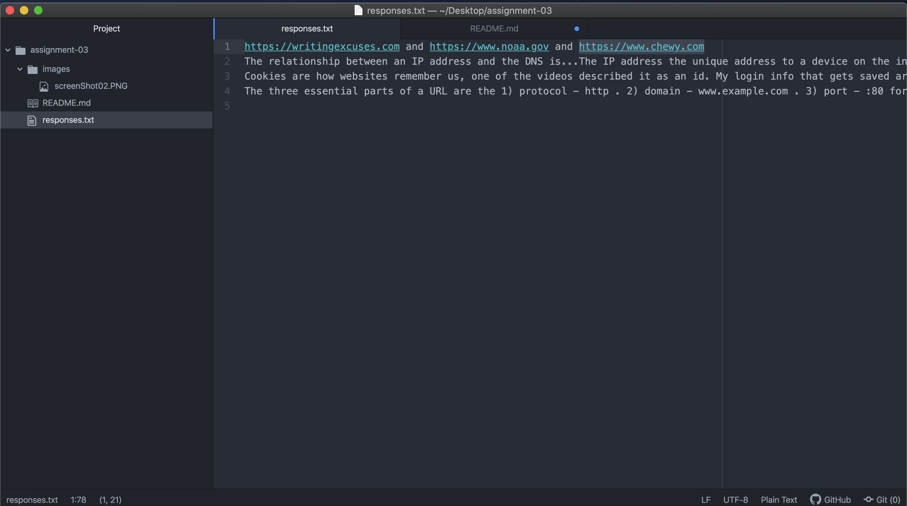

# Assignment 3
## Layla Hall
1. Bits are 1s and 0s or the on and offs.
2. The internet was the result of a defense department project, they were scared of a nuclear attack.
3. A protocol is like the country of a sites address.
- <https://writingexcuses.com>
- <https://www.noaa.gov>  
- <https://www.chewy.com>
- [My responses](./responses.txt)
-  
