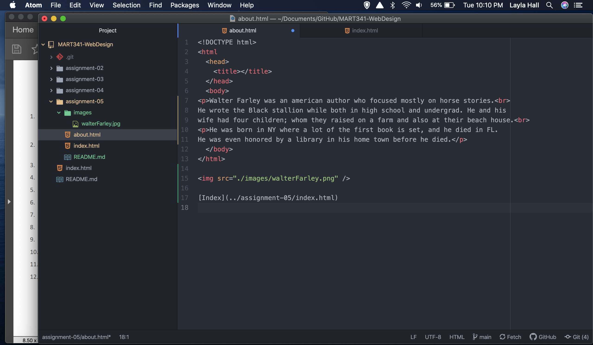

I went to The NEW YORK Times website.
A snapshot from 1996, the year I was born. I was hoping for something on my birthday but no luck.
I chose Nov 12, 1996. It was very simple compared to what it's like now. One change is under the main title it says "on the web" which of course it no longer does.
This week was challenging. It took many hours to figure out the linking for some reason. I thought I had done it right many times without it popping up. Then it seemed to randomly work. I am not sure how or why it happened like that.
I think I have a good understanding of how to do paragraphs now, and the 4 main document elements.

